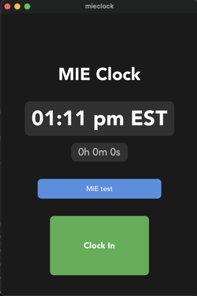

# MIE Clock

A desktop application for tracking work hours with iMessage integration. Built to simplify time tracking by automatically sending clock in/out notifications to MIE iMessage chats.



## Why?

- No more manual time tracking
- Automatic notifications in MIE chat
- Easy to use interface
- Persistent state across sessions
- Dark mode support

## Features

- Clock in/out with iMessage notifications
- Automatic time tracking and duration calculation
- MIE chat selection and persistence
- Dark mode support
- State persistence across sessions

## Implementation

Built with:

- Frontend: React + TypeScript + Tauri
- Backend: Rust + AppleScript
- Styling: CSS with dark mode support

### AppleScript Integration

The app uses AppleScript to interact with iMessage:

```applescript
-- Send message to specific chat
tell application "Messages"
    set targetService to 1st service whose service type = iMessage
    set targetChat to chat id "chat123" of targetService
    send "Clock in" to targetChat
end tell

-- Get MIE chats
tell application "Messages"
    set targetService to 1st service whose service type = iMessage
    set mieChats to {}
    repeat with c in chats of targetService
        if name of c contains "MIE" then
            set end of mieChats to {name:name of c, guid:id of c}
        end if
    end repeat
end tell
```

## Setup

### Requirements

- macOS
- Bun
- Rust
- Xcode Command Line Tools

### Installation

```bash
bun install
bun run tauri dev
```

### Build

```bash
bun run tauri build
```

## License

MIT
